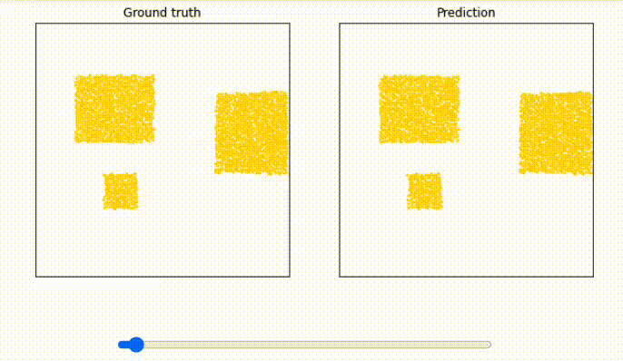

# `learning_to_simulate`

## Summary

Created a notebook with changes to validate the paper's implementation on `Google Colab`

As a sample, publish the implementation of the following paper running on `Colab`.

> Learning to Simulate Complex Physics with Graph Networks (ICML 2020)
>
> GitHub: [deepmind/deepmind-research/learning_to_simulate](https://github.com/deepmind/deepmind-research/tree/master/learning_to_simulate)
> 
> ICML poster: [icml.cc/virtual/2020/poster/6849](https://icml.cc/virtual/2020/poster/6849)
> 
> Video site: [sites.google.com/view/learning-to-simulate](https://sites.google.com/view/learning-to-simulate)
>
> ArXiv: [arxiv.org/abs/2002.09405](https://arxiv.org/abs/2002.09405)

## These implementations allow

1. Visualization of learning status by `TensorBoard` on notebook

    

    > https://www.tensorflow.org/tensorboard/images/tensorboard.gif

2. Create animations by `matplotlib` to visualize learning results

    

## Notice

> Created at the time of the exercise.
> Tokyo University, Matsuo Lab, 2021 "World Model and Intelligence"
>
> 東京大学 松尾研究室 2021年度「世界モデルと知能」の演習時に作成したものです
>
> Please note that this is a hobby level.